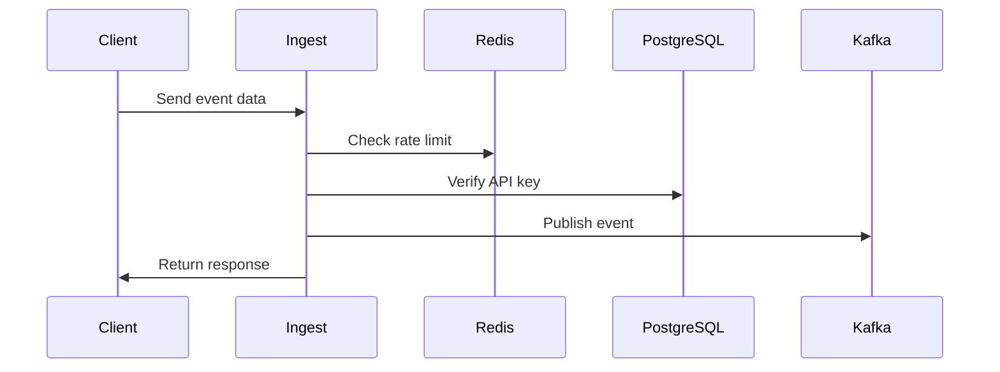

# Ingest Service

## Overview

The Ingest Service is the entry point for all analytics events. It handles data ingestion, validation, and publication to Kafka.

## Features

- Real-time event ingestion
- Batch event processing
- Request validation
- Rate limiting
- IP filtering
- GZIP compression support
- Authentication via API keys

## Architecture



## Configuration

### Environment Variables

| Variable | Description | Default |
|----------|-------------|---------|
| PORT | Server port | 4000 |
| KAFKA_BROKER | Kafka broker address | localhost:9092 |
| REDIS_HOST | Redis host | localhost |
| REDIS_PORT | Redis port | 6379 |
| DATABASE_URL | PostgreSQL connection string | - |

### Rate Limiting

Rate limits are configured per API key:
```typescript
interface RateLimit {
  requests: number;   // Maximum requests
  window: number;     // Time window in seconds
}
```

## Error Handling

| Status Code | Description | Example |
|------------|-------------|----------|
| 400 | Invalid request format | Missing required fields |
| 401 | Authentication failed | Invalid API key |
| 403 | IP not allowed | IP not in whitelist |
| 429 | Rate limit exceeded | Too many requests |
| 503 | Service unavailable | Kafka connection lost |

## Performance Considerations

1. Redis caching for rate limits
2. Connection pooling for PostgreSQL
3. GZIP compression for batch requests
4. Kafka batching for better throughput