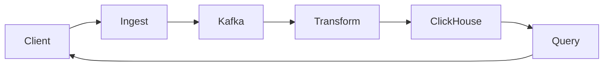

# Architecture Overview

The Analytics system is built with a microservices architecture, consisting of three main services:

## Service Architecture

## Components

1. **Ingest Service**: Handles incoming event data
   - Validates requests
   - Authenticates API keys
   - Rate limiting
   - Publishes to Kafka

2. **Transform Service**: Processes raw events
   - Consumes from Kafka
   - Enriches data
   - Handles deduplication
   - Stores in ClickHouse

3. **Query Service**: Provides analytics API
   - GraphQL interface
   - Complex queries
   - Data aggregation
   - Result caching

## Data Flow

1. Clients send events to Ingest Service
2. Events are validated and published to Kafka
3. Transform Service processes events
4. Processed data is stored in ClickHouse
5. Query Service provides analytics endpoints
6. Clients query analytics data via GraphQL