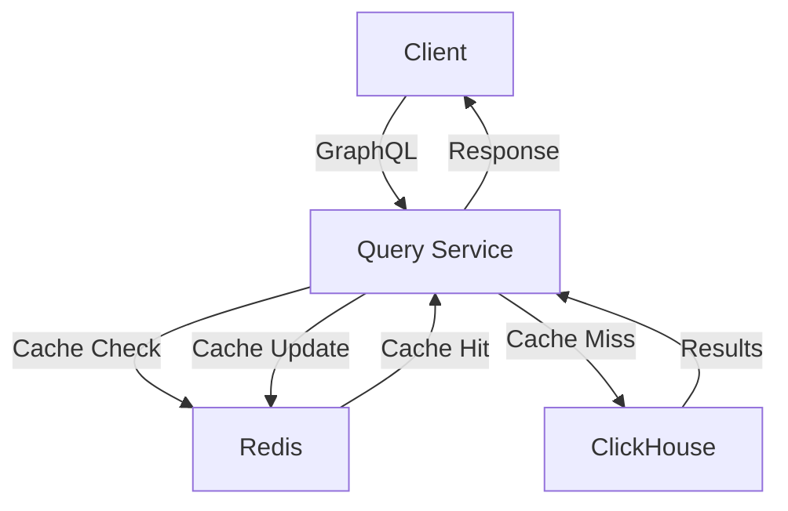

# Query Service

## Overview

The Query Service provides a GraphQL API for accessing and analyzing data stored in ClickHouse.

## Features

- GraphQL API
- Complex analytics queries
- Aggregations and grouping
- Time-series analysis
- Query optimization
- Result caching
- Rate limiting

## Architecture



## GraphQL Schema

### Types

```graphql
type EventStats {
  eventType: String!
  count: Int!
  uniqueUsers: Int!
}

type TimeSeriesData {
  timestamp: DateTime!
  value: Float!
}

type UserActivity {
  userId: String!
  eventCount: Int!
  lastActive: DateTime!
}
```

### Queries

```graphql
type Query {
  # Get event statistics
  eventStats(
    timeRange: TimeRange!
    eventType: String
  ): [EventStats!]!

  # Get time series data
  timeSeriesData(
    metric: String!
    timeRange: TimeRange!
    interval: Interval!
  ): [TimeSeriesData!]!

  # Get user activity
  userActivity(
    timeRange: TimeRange!
    limit: Int
  ): [UserActivity!]!
}
```

## Caching

### Strategy
- Query-based caching
- TTL per query type
- Automatic invalidation
- Cache bypass options

### Configuration
```typescript
interface CacheConfig {
  ttl: number;          // Time to live in seconds
  maxSize: number;      // Maximum cache size
  invalidationRules: []; // Cache invalidation rules
}
```

## Query Optimization

1. **Field Selection**
   - Only fetch required fields
   - Optimize joins
   - Minimize data transfer

2. **Aggregation**
   - Push down to ClickHouse
   - Use materialized views
   - Optimize group operations

3. **Performance**
   - Query planning
   - Result pagination
   - Resource limits

## Error Handling

| Error Type | Description | Resolution |
|------------|-------------|------------|
| Syntax | Invalid GraphQL query | Return detailed error |
| Timeout | Query took too long | Cancel and notify |
| Resource | Memory/CPU limits | Apply backpressure |

## Monitoring

- Query performance metrics
- Cache hit rates
- Error rates
- Resource usage
- Response times