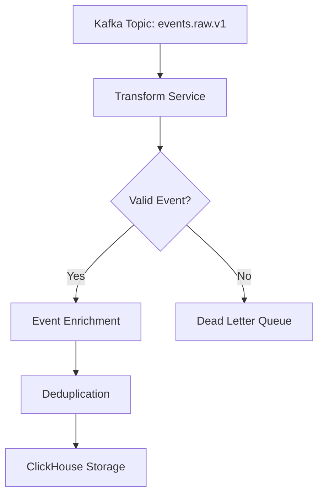

# Transform Service

## Overview

The Transform Service processes raw analytics events from Kafka, enriches them with additional data, and stores them in ClickHouse for analysis.

## Features

- Event enrichment
- Data transformation
- Deduplication
- Schema validation
- Error handling
- Dead letter queue
- Batch processing

## Architecture

## Configuration

### Environment Variables

| Variable | Description | Default |
|----------|-------------|---------|
| KAFKA_BROKER | Kafka broker address | localhost:9092 |
| KAFKA_GROUP_ID | Consumer group ID | transform-service |
| CLICKHOUSE_HOST | ClickHouse host | localhost |
| CLICKHOUSE_PORT | ClickHouse port | 8123 |

## Event Processing

### 1. Consumption
- Reads events from Kafka
- Manages consumer group offsets
- Handles partition rebalancing

### 2. Validation
- Validates event schema
- Checks required fields
- Verifies data types

### 3. Enrichment
- Adds metadata
- Resolves references
- Enhances event data

### 4. Storage
- Deduplicates events
- Writes to ClickHouse
- Handles batch operations

## Error Handling

1. **Invalid Events**
   - Logged with details
   - Sent to dead letter queue
   - Original event preserved

2. **Connection Issues**
   - Automatic retry
   - Circuit breaking
   - Error reporting

3. **Data Consistency**
   - Transaction management
   - Idempotent processing
   - Error recovery

## Performance Optimization

- Batch processing
- Connection pooling
- Efficient deduplication
- Parallel processing
- Memory management